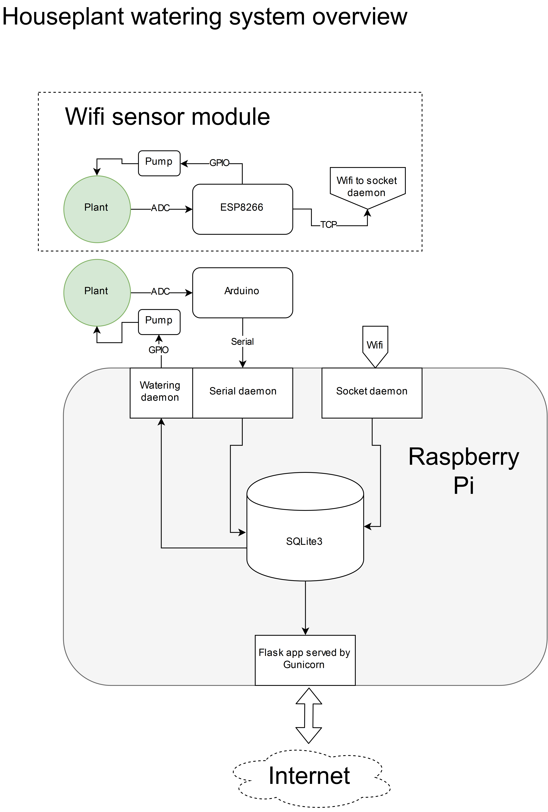

# watering
My watering system for houseplants. Check it out at [pansartax.duckdns.org](http://pansartax.duckdns.org)!

## Overview
My watering system is a distributed network of devices communicating mostly over WiFi. A Sqlite3 database keeps all the data from the pots, and it's displayed in a simple flask web app.

There are two sensors in the system currently, one communicating with the server directly over serial, and one running an ESP8266 sending data over a TCP socket.

